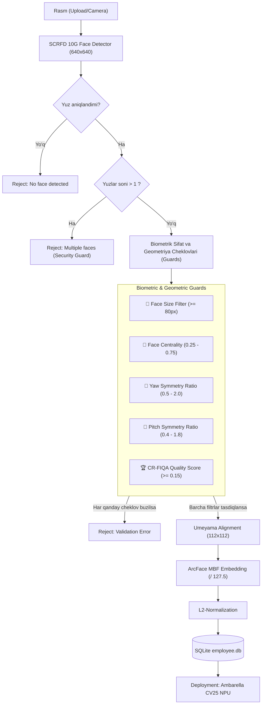

# 🚀 Face Enrollment & Database Builder

Xodimlarni biometrik ro'yxatdan o'tkazish (Enrollment), tasvirlar sifatini ko'p bosqichli
tekshirish (Biometric Guards) va **Ambarella CV25 Cavalry NPU** bilan 100% mutanosib
`employee.db` ma'lumotlar bazasini yaratish uchun mo'ljallangan Python skripti.

Web backend ushbu skriptni `subprocess` orqali chaqiradi — hech qanday server
yoki API kerak emas.

---

## 📊 Tizim Arxitekturasi (Pipeline)



---

## ⚙️ Model va Normalizatsiya Mutanosibligi

| Model | Fayl | Input | Maqsad |
|---|---|---|---|
| **SCRFD 10G** | `scrfd_10g_bnkps.onnx` | 640×640, `/128.0` | Yuz topish + 5 keypoint |
| **ArcFace MBF** | `w600k_mbf.onnx` | 112×112, `/127.5` | 512-dim embedding |
| **CR-FIQA** | `crfiqa_s_quality_opset11.onnx` | 112×112, `/128.0` | Biometrik sifat bahosi |

> [!IMPORTANT]
> Uchala ONNX fayl `models/` papkasida bo'lishi shart — skript ularni
> fayl nomi bo'yicha **avtomatik topadi**, yo'l ko'rsatish shart emas.

---

## 🛡 Biometrik Cheklovlar (Guards)

| # | Cheklov | Default | Tavsif |
|---|---|---|---|
| 1 | **Face Size** | `>= 80 px` | Kichik va uzoqdagi yuzlarni rad etadi |
| 2 | **Face Centrality** | `0.25 – 0.75` | Yuz ramkaning markazida bo'lishi shart |
| 3 | **Yaw Pose** | `0.5 – 2.0` | Chapga/o'ngga burilishni cheklaydi |
| 4 | **Pitch Pose** | `0.4 – 1.8` | Tepaga/pastga egilishni cheklaydi |
| 5 | **CR-FIQA Score** | `>= 0.15` | Biometrik aniqlik va yoritilganlik sifati |
| 6 | **Multi-Face Reject** | `max 1` | Bir rasmda bir nechta odam — rad etiladi |

---

## 🛠 O'rnatish

```bash
cd faceProject
python3 -m venv venv
source venv/bin/activate
pip install -r requirements.txt
```

**Kerakli paketlar:**

```
onnxruntime
opencv-python-headless
numpy
scikit-image
```

---

## 🚀 Ishlatish

### Rejim 1 — Bitta kishi (web backend har upload da chaqiradi)

```bash
python3 build_db.py \
  --name "Ali Karimov" \
  --photos /tmp/uploads/ali1.jpg /tmp/uploads/ali2.jpg \
  --db /srv/nfs/client_001.db
```

**Konsol natijasi:**
```
[MODEL] SCRFD:   models/scrfd_10g_bnkps.onnx
[MODEL] ArcFace: models/w600k_mbf.onnx
[MODEL] CR-FIQA: models/crfiqa_s_quality_opset11.onnx

[INFO] Kishi   : 'Ali Karimov'
[INFO] Rasmlar : 2 ta
[INFO] DB      : /srv/nfs/client_001.db

  [OK]   /tmp/uploads/ali1.jpg  (quality=0.724)
  [WARN] /tmp/uploads/ali2.jpg: Face is turned too far sideways (Yaw ratio: 0.41)

[DONE] 'Ali Karimov': 1 embedding saqlandi, 1 rasm rad etildi
[DB]   Jami: 1 kishi, 1 embedding, 28 KB
```

---

### Rejim 2 — Papkadan to'liq bazani qayta qurish (batch)

Rasm tuzilmasi:
```
photos/
├── Ali_Karimov/
│   ├── 1.jpg
│   └── 2.jpg
└── Vali_Toshmatov/
    └── front.jpg
```

> Papka nomi avtomatik ravishda xodim ismi sifatida ishlatiladi:
> `Ali_Karimov` → `"Ali Karimov"`

```bash
python3 build_db.py \
  --photos-dir ./photos/ \
  --db /srv/nfs/client_001.db
```

**Konsol natijasi:**
```
[MODEL] SCRFD:   models/scrfd_10g_bnkps.onnx
[MODEL] ArcFace: models/w600k_mbf.onnx
[MODEL] CR-FIQA: models/crfiqa_s_quality_opset11.onnx

[INFO] 2 ta kishi papkasi topildi | DB: /srv/nfs/client_001.db

[INFO] Ali Karimov (2 ta rasm):
  [OK]   photos/Ali_Karimov/1.jpg  (quality=0.724)
  [OK]   photos/Ali_Karimov/2.jpg  (quality=0.681)

[INFO] Vali Toshmatov (1 ta rasm):
  [OK]   photos/Vali_Toshmatov/front.jpg  (quality=0.803)

────────────────────────────────────────────────────────
[DONE]  Tugadi!
        2/2 kishi ro'yxatga olindi
        3 embedding saqlandi, 0 rasm rad etildi
[DB]    /srv/nfs/client_001.db  (56 KB)
```

---

### Web backend integratsiyasi

```python
import subprocess

result = subprocess.run(
    [
        "python3", "/opt/faceProject/build_db.py",
        "--name",   "Ali Karimov",
        "--photos", "/uploads/abc/photo1.jpg", "/uploads/abc/photo2.jpg",
        "--db",     "/srv/nfs/client_001.db",
    ],
    capture_output=True,
    text=True,
)

if result.returncode == 0:
    # employee.db tayyor — web team kameraga yuboradi
    print(result.stdout)
else:
    # Xatolik: hech qanday yuz saqlanmadi
    print(result.stderr)
```

**Exit code:**
| Holat | Kod |
|---|---|
| Muvaffaqiyatli | `0` |
| Hech qanday embedding saqlanmadi | `1` |
| Model / papka topilmadi | `1` |

---

## ⚡️ Ishlash Ko'rsatkichlari (1-to-N Benchmark)

Agarda korxonada **10,000 nafar xodim** va **5 tadan yuz vektori (jami 50,000 ta embedding)** bo'lsa:

| Ko'rsatkich | Server (Python + NumPy) | Kamera (CV25 NPU) |
|---|---|---|
| **1-to-N qidiruv** | 1.5 – 3.0 ms | 5 – 10 ms |
| **RAM iste'moli** | ~110 MB | ~110 MB |

$$\text{Hajm} = 50{,}000 \times 512 \times 4\ \text{bayt} \approx 97.66\ \text{MB}$$

---

## 🎨 10-Bosqichli Vizual Debug (ixtiyoriy)

```bash
python3 debug_pipeline.py --image /path/to/photo.jpg --out-dir ./debug_output
```

| # | Fayl | Nima ko'rsatiladi |
|---|---|---|
| 1 | `01_raw_input.jpg` | Asl rasm |
| 2 | `02_letterbox_input.jpg` | SCRFD uchun 640×640 padding |
| 3 | `03_detection_raw.jpg` | Barcha detektor nomzodlari |
| 4 | `04_detection_filtered.jpg` | NMS o'tgan yuz + keypoints |
| 5 | `05_size_check.jpg` | O'lcham filtri (yashil/qizil) |
| 6 | `06_centrality_check.jpg` | Markaziylik zonasi |
| 7 | `07_pose_check.jpg` | Yaw / Pitch simmetriya o'qlari |
| 8 | `08_umeyama_aligned.jpg` | 112×112 aligned yuz chipi |
| 9 | `09_crfiqa_quality.jpg` | CR-FIQA sifat bahosi |
| 10 | `10_final_arcface.jpg` | ArcFace embedding vizualizatsiyasi |

---

## 📁 Fayl Tuzilmasi

```
faceProject/
├── build_db.py          ← Asosiy skript (bu yerdan boshlang)
├── pipeline.py          ← SCRFD + Align + ArcFace + Guards
├── database.py          ← SQLite (CV25 bilan mutanosib schema)
├── debug_pipeline.py    ← 10-bosqichli vizual debug (ixtiyoriy)
├── requirements.txt     ← pip dependencies
├── models/              ← ONNX modellar (avtomatik topiladi)
│   ├── scrfd_10g_bnkps.onnx
│   ├── w600k_mbf.onnx
│   └── crfiqa_s_quality_opset11.onnx
└── legacy/
    └── main.py          ← Eski FastAPI server (arxiv)
```
