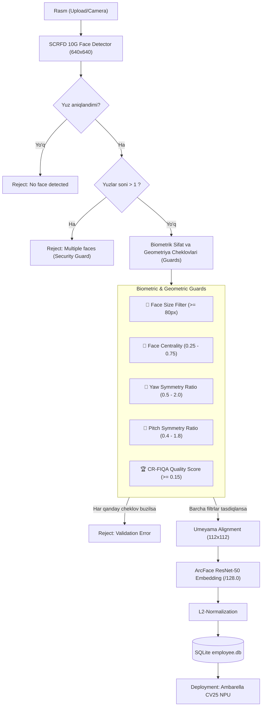

# 🚀 Face Enrollment & Recognition Service

Xodimlarni biometrik ro'yxatdan o'tkazish (Enrollment), tasvirlar sifatini ko'p bosqichli tekshirish (Biometric Guards), mos keluvchi `employee.db` ma'lumotlar bazasini yaratish hamda serverda 1-to-N yuz tanish (Identification) uchun mo'ljallangan yuqori samarali backend servis.

Ushbu backend **Ambarella CV25 Cavalry NPU** chipidagi kamera dasturiy ta'minoti bilan **100% mutanosib** qilib ishlab chiqilgan bo'lib, biometrik xavfsizlikni maksimal darajaga ko'taradi.

---

## 📊 Tizim Arxitekturasi (Pipeline)

Quyidagi oqim diagrammasida rasm yuklanishidan tortib to bazaga yozilguniga qadar bo'lgan to'liq zanjir keltirilgan:



---

## ⚡️ Ishlash Tezligi va RAM Analizi (1-to-N Benchmark)

Agarda korxonada **10,000 nafar xodim** bo'lsa va har birining **5 tadan yuz vektori (jami 50,000 ta embedding)** bazada saqlansa:

### 1. ⏱ Solishtirish tezligi (1-to-N Search Time)
*   **Vektor o'lchami:** 512 ta float32 elementdan iborat.
*   **Matematik jarayon:** Kiruvchi test yuzning embedding vektori bazadagi barcha $50,000$ ta vektorlar bilan **Matrix Multiplication (Dot Product)** qilinadi (vektorlar L2 normalizatsiya qilinganligi bois, Dot Product to'g'ridan-to'g'ri **Cosine Similarity** ga teng).
*   **Serverda (Python + NumPy):** NumPy kutubxonasining BLAS optimizatsiyalari (masalan, Intel MKL/OpenBLAS) tufayli $1 \times 512$ va $512 \times 50000$ matritsalarni ko'paytirish **atigi 1.5 - 3.0 millisekund** vaqt oladi.
*   **Kamerada (Ambarella CV25 NPU):** Agar barcha vektorlar kameraning tezkor xotirasida (RAM) saqlansa, sequential yoki batch dot-product hisoblash **5 - 10 millisekund**dan oshmaydi.

### 2. 💾 RAM iste'moli (RAM Occupancy)
Vektorlarni xotiraga (RAM) to'liq yuklab olish quyidagicha hajm talab etadi:
$$\text{Hajm} = 50,000 \text{ ta vektor} \times 512 \text{ float32} \times 4 \text{ bayt} = 102,400,000 \text{ bayt} \approx 97.66 \text{ MB}$$

SQLite metadata va indekslari, Python ob'ektlari strukturasini hisobga olganda ham jami RAM iste'moli **110 MB atrofida** bo'ladi. Bu ko'rsatkich Ambarella CV25 kabi cheklangan resursli tizimlar uchun ham juda kichik va xavfsizdir.

---

## ⚙️ Model va Normalizatsiya Mutanosibligi

*   **Detektor:** `scrfd_10g_bnkps.onnx` (InsightFace-ning keypoints taqdim etuvchi eng kuchli 10G modeli, `640x640` input o'lchamli letterbox qo'llaniladi).
*   **Tanib oluvchi (Recognition):** `w600k_mbf.onnx` (ArcFace MobileFaceNet backbone).
*   **Normalizatsiya koeffitsiyenti:** `/ 128.0` standard.
    > [!IMPORTANT]
    > Ambarella Cavalry NPU modeli tasvirlarni `/128.0` koeffitsiyenti bo'yicha normalizatsiya qiladi. Python backendda ko'plab kutubxonalar sukut bo'yicha `/127.5` dan foydalanadi. Tizimda bu qiymat `/128.0` ga moslashtirildi, natijada server va kamera vektorlari orasidagi o'xshashlik **0.999998** ga yetib, absolute sinxronlik ta'minlandi.

---

## 🛡 Biometrik Cheklovlar va Himoya Qoidalari (Guards)

Tizim bazasiga sifatsiz yoki aldovchi (spoofing) rasmlar kirishining oldini olish maqsadida quyidagi **dinamik parametrli guards** integratsiya qilingan:

| # | Cheklov Nomi | Parametr | Default Qiymat | Tavsif |
|---|---|---|---|---|
| 1 | **Face Size Filter** | `min_face_size` | `80` px | Yuzning eni va bo'yi minimal o'lchami. Kichik va uzoqdan olingan yuzlarni rad etadi. |
| 2 | **Face Centrality** | `min_cx/y_ratio`, `max_cx/y_ratio` | `0.25 - 0.75` | Yuz ramkaning markazida joylashishi shart. Burchakda qolib ketgan tasvirlar rad etiladi. |
| 3 | **Yaw Pose Limit** | `min/max_yaw_ratio` | `0.5 - 2.0` | Yuzning o'ngga/chapga burilish simmetriyasi. Keypointlar nisbati buzilganda rad etiladi. |
| 4 | **Pitch Pose Limit** | `min/max_pitch_ratio` | `0.4 - 1.8` | Yuzning tepaga/pastga egilish simmetriyasi. Portret darajasidan yuqori og'ishlarni cheklaydi. |
| 5 | **CR-FIQA Score** | `min_quality_score` | `0.15` | Certainty Ratio Face Image Quality Assessment orqali biometrik aniqlik va yoritilganlik sifati. |
| 6 | **Multi-Face Reject** | `max_faces` | `1` | Rasmda bittadan ko'p odam bo'lsa rad etiladi (baza chalkashligining oldini olish uchun). |

---

## 📡 API Endpointlar

Backend ishga tushgach, to'liq interaktiv hujjatlar va test paneli quyidagi manzilda ochiladi:
👉 **[http://localhost:8000/docs](http://localhost:8000/docs)** (Swagger UI)

### 1. Dinamik Sozlamalar (`GET` va `POST /config`)

Ushbu endpointlar orqali tizim cheklovlarini serverni o'chirmasdan, real-vaqt rejimida boshqarish mumkin.

*   **Joriy sozlamalarni olish:**
    ```bash
    curl -X GET http://localhost:8000/config
    ```
*   **Yangi qiymatlarni o'rnatish:**
    ```bash
    curl -X POST http://localhost:8000/config \
      -H "Content-Type: application/json" \
      -d '{
        "min_face_size": 100,
        "min_quality_score": 0.20,
        "similarity_threshold": 0.38
      }'
    ```

---

### 2. 1-to-N Shaxsni Aniqlash (`POST /identify`)

Yuz tasvirini yuborib, bazadagi barcha xodimlar ichidan eng mosini topish.

*   **So'rov yuborish:**
    ```bash
    curl -X POST http://localhost:8000/identify \
      -F "photo=@test_person.jpg"
    ```
*   **Tizim xodimni aniqlagan holatda (Similarity >= `similarity_threshold`):**
    ```json
    {
      "recognized": true,
      "person_id": 15,
      "name": "Saidakbar",
      "similarity_score": 0.896295,
      "threshold": 0.35
    }
    ```
*   **Tizim tanimagan yoki o'xshashlik past bo'lgan holatda (Similarity < `threshold`):**
    ```json
    {
      "recognized": false,
      "similarity_score": 0.214051,
      "threshold": 0.35,
      "message": "Best match score (0.2141) is below threshold (0.35)"
    }
    ```

---

### 3. Yangi Xodimni Ro'yxatdan O'tkazish (`POST /enroll`)

*   **So'rov yuborish (Bir nechta rasm yuborish imkoniyati bilan):**
    ```bash
    curl -X POST http://localhost:8000/enroll \
      -F "name=Sirojiddin Narzullayev" \
      -F "photos=@sirojiddin_clear.jpg" \
      -F "photos=@sirojiddin_group.jpg"
    ```
*   **Javob (Rad etilgan rasmlar tafsiloti bilan):**
    ```json
    {
      "person_id": 18,
      "name": "Sirojiddin Narzullayev",
      "photos_processed": 1,
      "photos_failed": 1,
      "embed_count": 1,
      "failed_files": [
        "sirojiddin_group.jpg: ValueError('Multiple faces detected (3), only 1 face allowed per photo')"
      ]
    }
    ```

---

### 4. Bazani Yuklab Olish (`GET /database/export`)

Kamera dasturi uchun to'liq mos keladigan `employee.db` faylini yuklab olish.
```bash
curl http://localhost:8000/database/export -o employee.db
```

---

## 🛠 O'rnatish va Ishga Tushirish

### 1. Muhitni sozlash va bog'liqliklarni o'rnatish
```bash
cd enrollment_service
python3 -m venv venv
source venv/bin/activate
pip install -r requirements.txt
```

### 2. Environment o'zgaruvchilarini sozlash (.env orqali)

Model yo'llari va ma'lumotlar bazasi manzilini sozlash uchun `.env` faylidan foydalanish tavsiya etiladi:

```bash
# 1. Shablondan nusxa oling:
cp .env.example .env

# 2. .env faylini o'zingizning tizimingizga moslab tahrirlang.
```

Agarda o'zgaruvchilarni terminalda vaqtincha eksport qilmoqchi bo'lsangiz:
```bash
export SCRFD_MODEL="/home/nsn/Workspace/Embedding_AI/enrollment_service/models/scrfd_10g_bnkps.onnx"
export ARCFACE_MODEL="/home/nsn/Workspace/Embedding_AI/enrollment_service/models/w600k_mbf.onnx"
export CRFIQA_MODEL="/home/nsn/Workspace/Embedding_AI/enrollment_service/models/crfiqa_s_quality_opset11.onnx"
export DB_PATH="/srv/nfs/employee.db"
```

### 3. Serverni ishga tushirish
```bash
python main.py
# yoki reload rejimi bilan:
uvicorn main:app --host 0.0.0.0 --port 8000 --reload
```

---

## 📲 Kameraga Hot-Reload Yuklash Tartibi

Yaratilgan `employee.db` bazasini kameraga yuklab, uni tizimga qo'llash quyidagi sodda buyruqlar orqali amalga oshiriladi:

1.  **NFS papkaga bazani nusxalash (Server tomonda):**
    ```bash
    cp employee.db /srv/nfs/employee.db
    ```
2.  **Kamera telnet yoki SSH terminali orqali (Kamera tomonda):**
    ```bash
    # Yangi db faylini SD-kartaga ko'chirish va yuz tanish algoritmini restart qilish
    cp /sdcard/nfs/employee.db /sdcard/employee.db && killall cv_alg
    
    # 1 soniya kutib, algoritm jarayonini orqa fonda qayta ishga tushirish
    sleep 1
    /opt/app/bin/cv_alg &
    ```

3.  **Tekshirish:**
    Kamera loglarida quyidagi yozuv paydo bo'ladi:
    `ts=... lvl=SUCCESS src=EmployeeDB msg="Loaded DB: X entries"` (bu yerda `X` - ro'yxatga olingan jami xodimlar soni).

---

## 🎨 10-Bosqichli Vizual Debug Tizimi (Visual Pipeline Debugger)

Tizimga yuklanayotgan yuz rasmini har bir bosqich bo'yicha to'liq tahlil qilish uchun maxsus vizualizatsiya tizimi yaratildi. Skript yordamida rasmning qaysi filtrdan qanday o'tganini va embedding qanday shakllanganini to'liq ko'ra olasiz.

### Skriptni ishga tushirish:
```bash
# default Saidakbar passport rasmi bilan tekshirish:
./debug_pipeline.py

# Istalgan rasm bilan tekshirish:
./debug_pipeline.py --image /path/to/photo.jpg --out-dir /path/to/debug_output
```

### 10 ta vizual qadamlar ro'yxati:
Tekshirish yakunida belgilangan `debug_output/` papkasiga quyidagi 10 ta tahliliy rasm saqlanadi:
1.  **`01_raw_input.jpg`**: Asl yuklangan rasm (original).
2.  **`02_letterbox_input.jpg`**: SCRFD modeli uchun yuz proporsiyasini buzmasdan `640x640` o'lchamga o'tkazilgan va chetlari qora hoshiya (padding) qilingan tasvir.
3.  **`03_detection_raw.jpg`**: Detektor aniqlagan barcha yuz nomzodlari va ularning xom ballari overlayi.
4.  **`04_detection_filtered.jpg`**: NMSdan o'tgan eng ishonchli yuz va uning 5 ta biometrik tayanch nuqtalari (keypoints).
5.  **`05_size_check.jpg`**: Yuz o'lchami minimal `min_face_size` chegara talabiga javob berishi (yashil - OK, qizil - rejected).
6.  **`06_centrality_check.jpg`**: Yuz markazini tekshirish hududi (`0.25 - 0.75`) va yuz markaziy nuqtasi vizualizatsiyasi.
7.  **`07_pose_check.jpg`**: Yuz burilishlarini tekshirish uchun o'ng/chap (Yaw) va tepa/past (Pitch) simmetriya o'qlari hamda hisoblangan nisbatlar.
8.  **`08_umeyama_aligned.jpg`**: Umeyama affin almashtirishi yordamida standart `112x112` o'lchamga keltirilgan toza yuz chipi.
9.  **`09_crfiqa_quality.jpg`**: CR-FIQA neyron tarmog'ining biometrik sifat baholash natijasi (yashil overlay - sifatli, qizil - yaroqsiz).
10. **`10_final_arcface.jpg`**: Tayyor yuz chipi hamda uning yonida **512 o'lchamli ArcFace embedding vektorining dastlabki 64 ta qiymatini aks ettiruvchi premium bar-chart** vizualizatsiyasi paneli!

